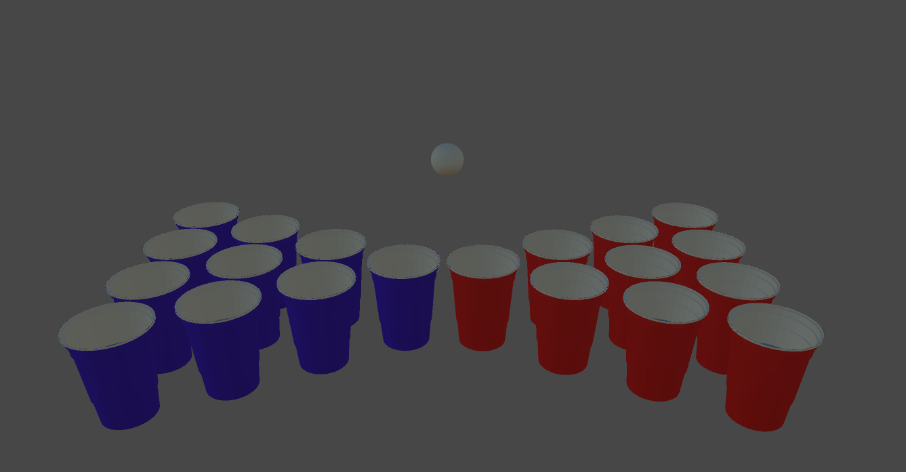
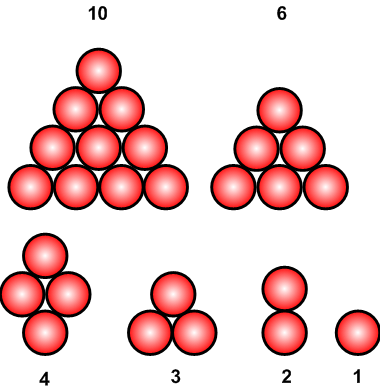

# BeerpongVR

Beerpong VR is a small application developed by 2 students, [Upd4ting](https://github.com/Upd4ting) and [TheYoxy](https://github.com/TheYoxy). The prototype was made in only one night, because of a challenge between Upd4ting and TheYoxy.

## Description
As the name is saying, it's a small beerpong game into the mixed reality helmet, the [Hololens](https://www.microsoft.com/en-us/hololens).\
This game cares about the environment, so you'll have to scan the room to find a table where you'll play.

## Library used 
- [The Microsoft Mixed Reality Toolkit](https://github.com/Microsoft/MixedRealityToolkit-Unity)
- [Hololens Template](https://github.com/Upd4ting/HololensTemplate)
- [Outline-Effect](https://github.com/cakeslice/Outline-Effect)
> _Everything else in the application has been made by hand._

## Rules

- The player 1 is always the host of the application.

- The player 1 is the player who have to shoot in the blue cup.\
The player 2 is the player who have to shoot in the red cup.

_Incoming_

## Pictures

_Coming soon._

## Next features ideas

- Replace cups when there is 6,4,3,2,1 cup(s) left.

> We are open for any idea

> OUI.
